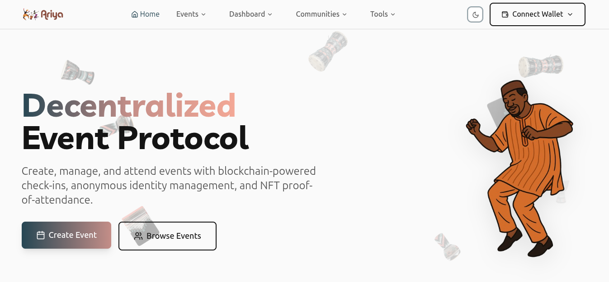

  <picture>
    
  </picture>

<h3 align="center">
  Ariya Protocol
</h3>

 

  
  

  
    Ariya Protocol is a Web3-powered event protocol bringing trust, transparency, and community ownership to event management.
  

---

  

## How It Works

Ariya Protocol enables seamless event management through blockchain-native features:

- **Organizers** create events with reputation tracking and performance metrics
- **Attendees** get ephemeral access passes and earn NFT proofs of attendance
- **Sponsors** fund events with automated performance-based settlements
- **Communities** form around events with token-gated access

##  Key Features

### **Event Management**

- Create and manage events with real-time capacity tracking
- Public organizer profiles with on-chain reputation
- Sponsor conditions with automated fund release

### **Privacy-First Attendance**

- Ephemeral access passes (24hr validity)
- QR code-based check-in/check-out
- No persistent identity storage

### **NFT Proof System**

- Proof-of-Attendance (PoA) NFTs on check-in
- Completion NFTs for full event participation
- Dynamic NFT metadata with event details

### **Automated Settlements**

- Escrow-based sponsor funding
- Performance-based fund release
- Transparent rating and reputation system

### **Token-Gated Communities**

- Event-based community formation
- NFT-gated access control
- Governance and resource sharing

### **Documentation Flow**

- Hierarchical chain-of-command approval workflows for event documents
- Multi-level document review and approval system with role-based access
- Complete audit trail tracking for all document submissions and approvals
- Automated funding release upon final document approval

## Status

> Ariya Protocol is **Live** on Sui Mainnet.

## Documentation

- [Smart Contract API](./move/docs/)

## License

Licensed under the MIT License. See [LICENSE](LICENSE) for more information.

## Built With

- **Blockchain**: [Sui](https://sui.io/) - High-performance Layer 1
- **Smart Contracts**: [Move](https://move-language.github.io/) - Safe, fast, and expressive
- **Frontend**: [React](https://reactjs.org/) + [TypeScript](https://typescriptlang.org/)

---

## Star History

Thanks for the crazy support 💖

